# Coupons

Will the drivers accept the coupons?

# Will a Customer Accept the Coupon?

## Project Overview

The goal of this project is to develop a brief report that highlights the differences between customers or drivers who did and did not accept driving coupons by using visualizations and probability distributions.

## Methodology

The Cross-Industry Standard Process for Data Mining (CRISP-DM) framework is applied to guide this effort. The framework includes five phases: business understanding, data understanding, data preparation, modeling, evaluation, and deployment. The first three phases will be the focus of this project due to the limited scope of this project.

## Business Understanding

### Background

Imagine driving through town and a coupon is delivered to your cell phone for a restaurant near where you are driving. Would you accept that coupon and take a short detour to the restaurant? Would you accept the coupon but use it on a subsequent trip? Would you ignore the coupon entirely? What if the coupon was for a bar instead of a restaurant? What about a coffee house? Would you accept a bar coupon with a minor passenger in the car? What about if it was just, you and your partner in the car? Would weather impact the rate of acceptance? What about the time of day?

Obviously, proximity to the business is a factor on whether the coupon is delivered to the driver or not, but what are the factors that determine whether a driver accepts the coupon once it is delivered to them? How would you determine whether a driver is likely to accept a coupon?

### Objective

The business objective is to distinguish between customers who accepted a driving coupon versus those that did not. This project attempts to answer the following questions:

-   What are two coupon types that can be selected for analysis?
-   What are the differences between drivers who accept and did not accept the selected driving coupons?
1.  Data Understanding

### Initial Data Collection

The initial data is from the UCI Machine Learning repository and was collected via a survey on Amazon Mechanical Turk. The survey describes different driving scenarios including the destination, current time, weather, passenger, etc., and then asks the person whether he will accept the coupon if he is the driver. Answers that the user will drive there ‘right away’ or ‘later before the coupon expires’ are labeled as ‘Y = 1’ and answers ‘no, I do not want the coupon’ are labeled as ‘Y = 0’. There are five different types of coupons -- less expensive restaurants (under \$20), coffee houses, carry out & take away, bar, and more expensive restaurants (\$20 - \$50).

### Initial Data Description

Below are the attributes and description of the initial data.

| **No.**                   | **Attribute names**  | **Description**                                                                                    | **Values**                                                                                                                       |
|---------------------------|----------------------|----------------------------------------------------------------------------------------------------|----------------------------------------------------------------------------------------------------------------------------------|
| **Customer attributes**   |                      |                                                                                                    |                                                                                                                                  |
| 1                         | gender               | Gender                                                                                             | male, female                                                                                                                     |
| 2                         | age                  | Age                                                                                                | below 21, 21 to 25, 26 to 30, etc.                                                                                               |
| 3                         | maritalStatus        | Marital Status                                                                                     | single, married partner, unmarried partner, or widowed                                                                           |
| 4                         | has_children         | Number of children                                                                                 | 0, 1, or more than 1                                                                                                             |
| 5                         | education            | Education                                                                                          | high school, bachelor’s degree, associate’s degree, or graduate degree                                                           |
| 6                         | occupation           | Occupation                                                                                         | architecture & engineering, business & financial, etc.                                                                           |
| 7                         | income               | Annual income                                                                                      | less than \$12500, \$12500 - \$24999, \$25000 - \$37499, etc.                                                                    |
| 8                         | car                  | Type of vehicles that customer is driving                                                          | mazda5, crossover, etc.                                                                                                          |
| 9                         | Bar                  | Number of times that he/she goes to a bar                                                          | 0, less than 1, 1 to 3, 4 to 8 or greater than 8                                                                                 |
| 10                        | CoffeeHouse          | Number of times that he/she goes to a coffee house                                                 | 0, less than 1, 1 to 3, 4 to 8 or greater than 8                                                                                 |
| 11                        | CarryAway            | Number of times that he/she buys takeaway food                                                     | 0, less than 1, 1 to 3, 4 to 8 or greater than 8                                                                                 |
| 12                        | RestaurantLessThan20 | Number of times that he/she eats at a restaurant with average expense less than \$20 per person    | 0, less than 1, 1 to 3, 4 to 8 or greater than 8                                                                                 |
| 13                        | Restaurant20To50     | Number of times that he/she eats at a restaurant with average expense from \$20 to \$50 per person | 0, less than 1, 1 to 3, 4 to 8 or greater than 8                                                                                 |
| **Coupon attributes**     |                      |                                                                                                    |                                                                                                                                  |
| 14                        | coupon               | Coupon types                                                                                       | less expensive restaurants (under \$20), coffee houses, carry out & take away, bar, and more expensive restaurants (\$20 - \$50) |
| 15                        | expiration           | Time before it expires                                                                             | 2 hours or one day                                                                                                               |
| **Contextual attributes** |                      |                                                                                                    |                                                                                                                                  |
| 16                        | destination          | Driving destination                                                                                | home, work, or no urgent destination                                                                                             |
| 17                        | passanger            | Passenger                                                                                          | alone, partner, kid(s), or friend(s)                                                                                             |
| 18                        | weather              | Weather                                                                                            | sunny, rainy, or snowy                                                                                                           |
| 19                        | temperature          | Temperature                                                                                        | 30F, 55F, or 80F                                                                                                                 |
| 20                        | time                 | Time                                                                                               | 10AM, 2PM, or 6PM                                                                                                                |
| 21                        | toCoupon_GEQ5min     | 5 minutes to venue                                                                                 | 0, 1                                                                                                                             |
| 22                        | toCoupon_GEQ15min    | 15 minutes to venue                                                                                | 15 minutes to venue                                                                                                              |
| 23                        | toCoupon_GEQ25min    | 25 minutes to venue                                                                                | 25 minutes to venue                                                                                                              |
| 24                        | direction_same       | Venue is in the same direction as the destination                                                  | 0, 1                                                                                                                             |
| 25                        | direction_opp        | Venue is in the opposite direction as the destination                                              | 0, 1                                                                                                                             |

### Initial Data Exploration and Quality

Below are some observations:

-   Most features or attributes are categorical.
-   Misspellings are observed in some instances.
-   Special characters are included in data.
-   The following attributes/features include NULL values.

    car 12576

    Bar 107

    CoffeeHouse 217

    CarryAway 151

    RestaurantLessThan20 130

    Restaurant20To50 189

    Add graph

## Data Preparation

### Data Selection

### Data Cleaning and Formatting

## Identify Coupon Type for Analysis

1.  What proportion of the total observations chose to accept the coupon?

As depicted in the Seaborn count plot below, fifty-seven percent of the total observations chose to accept the offered coupons. This indicates that there is an opportunity to increase the acceptance rate.

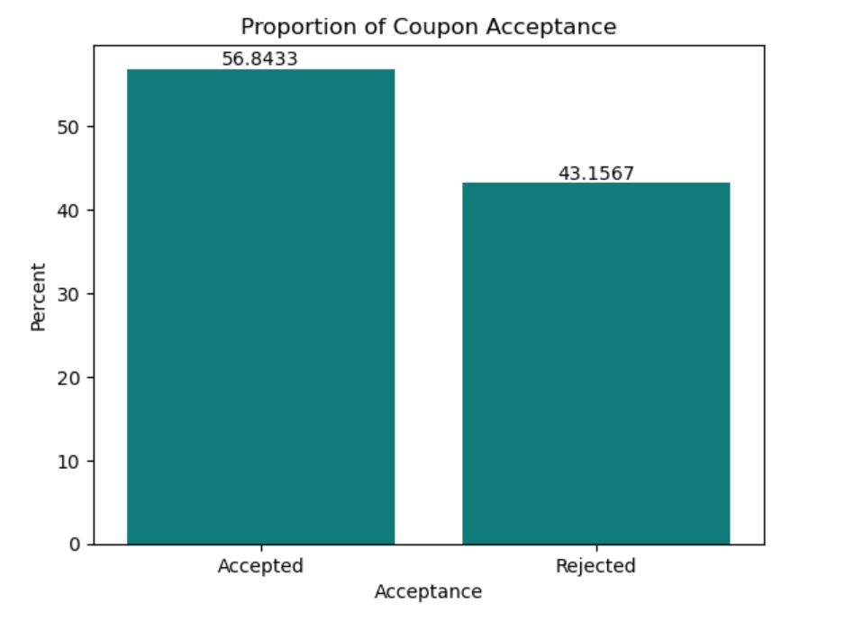

1.  Coupon acceptance distribution

With the Plotly violin diagram, there are three highlighted observations based on the density curves:

-   Accepted coupons are concentrated in three coupon types: Cheap restaurant, Coffee House and Carry out & Take Away coupons.
-   Rejected coupons are concentrated in two coupon types: Coffee House and Bar coupons.
-   Coffee House coupon is the most offered coupon type.

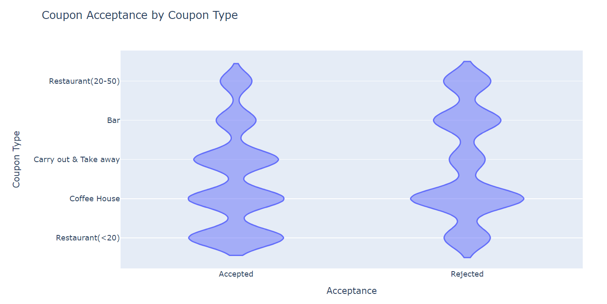

### Coupon acceptance rate

The Plotly histogram below displays the acceptance rates of each coupon type. Although Coffee House is the most offered coupon type, its accepted rate is only 50%. This could be a factor contributing to the overall acceptance rate which is slightly more than half as mentioned above.

"Carry out & Take away" coupon has the highest acceptance rate which is 74% and "Bar" coupon has the lowest acceptance rate which is 41%.

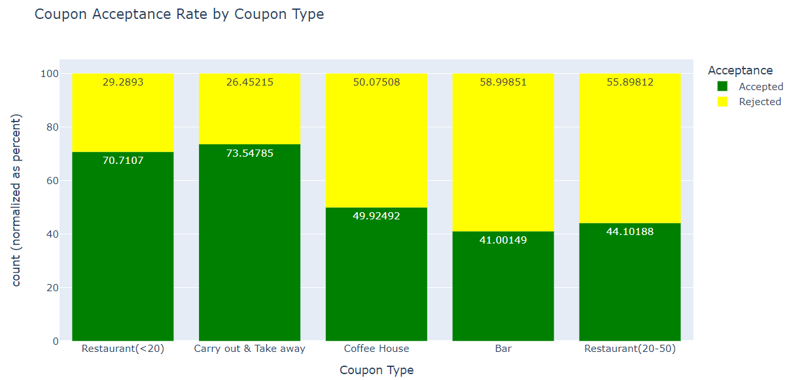

### What are two coupon types that can be selected for analysis?

To increase the overall acceptance rate, Bar coupon and Coffee House coupon will be analyzed because:

-   Bar coupon has the lowest acceptance rate
-   Coffee house is the most offered coupon type but accepted rate is only 50%
-   Rejected coupons are concentrated in these two coupon types: Coffee House coupons and Bar coupons

## Bar Coupon Analysis

### Proportion of accepted Bar coupons

Accepted Bar coupons account for 11.5% of accepted coupons, the second smallest proportion of total accepted coupons.

### Target Groups to compare the Bar coupon acceptance rates

Acceptance rates were calculated and visualized for six target groups and six corresponding non-target groups of drivers. Below is the list of target groups and non-target groups.

| **Group \#** | **Target Attributes**                                                | **Target Group**                                                                                                                        | **Non-Target Group**                  |
|--------------|----------------------------------------------------------------------|-----------------------------------------------------------------------------------------------------------------------------------------|---------------------------------------|
| Group 1      | Frequency of going to a bar                                          | Go to a bar 3 or fewer times a month                                                                                                    | Go to a bar more than 3 times a month |
| Group 2      | Frequency of going to a bar Age                                      | Go to a bar more than once a month  and Are over the age of 25                                                                          | All others                            |
| Group 3      | Frequency of going to a bar Passenger in the vehicle Occupancy       | Go to bars more than once a month  and Had passengers that were not a kid  and Had occupations other than farming, fishing, or forestry | All others                            |
| Group 4      | Frequency of going to a bar Passenger in the vehicle Marital status  | Go to bars more than once a month  and Had passengers that were not a kid and Were not widowed                                          | All others                            |
| Group 5      | Frequency of going to a bar Age                                      | Go to bars more than once a month  and Are under the age of 30                                                                          | All others                            |
| Group 6      | Frequency of going to cheap restaurants Income                       | Go to cheap restaurants more than 4 times a month and Income is less than 50K                                                           | All others                            |

The acceptance rates were calculated by using the following formula:

**Acceptance Rate of Target group** = Number of Bar coupons accepted by the Target Group / Number of Bar coupons offered to the Target Group

**Acceptance Rate of Non-Target group** = Number of Bar coupons accepted by the Non-Target Group / Number of Bar coupons offered to the Non-Target Group

In addition to the acceptance rates, proportion of accepted coupons was calculated with the following formula:

**Proportion of accepted coupons by Target group** = Number of Bar coupons accepted by the Target Group / Number of Bar coupons accepted

**Proportion of accepted coupons by Non-Target group** = Number of Bar coupons accepted by the Non-Target Group / Number of Bar coupons accepted

### Observations of the Bar coupon acceptance rate

The acceptance rate of Target Group 1 (those who went to a bar 3 or fewer times a month) is 37% and is much lower than the acceptance rate of Non-Target Group 1 (those who went to a bar more than 3 times a month) which is 77%.

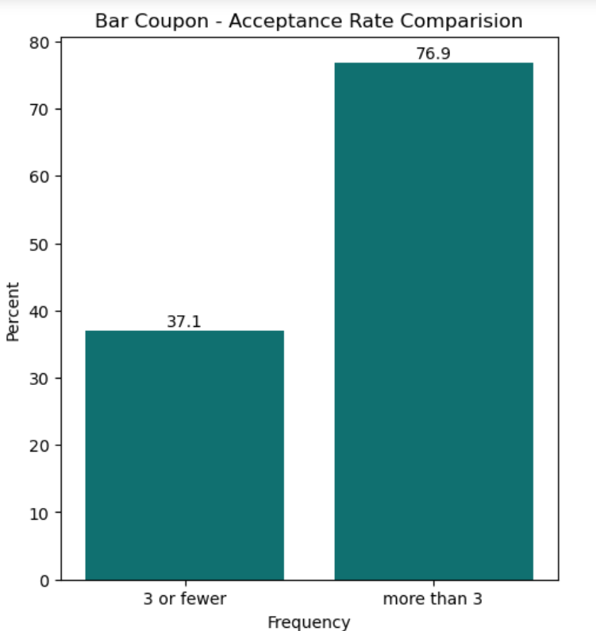

-   The acceptance rate of people who go to a bar more than once a month (regardless of other features such as age, passenger, occupancy) is about 70% (Target Group 2 – 5).

    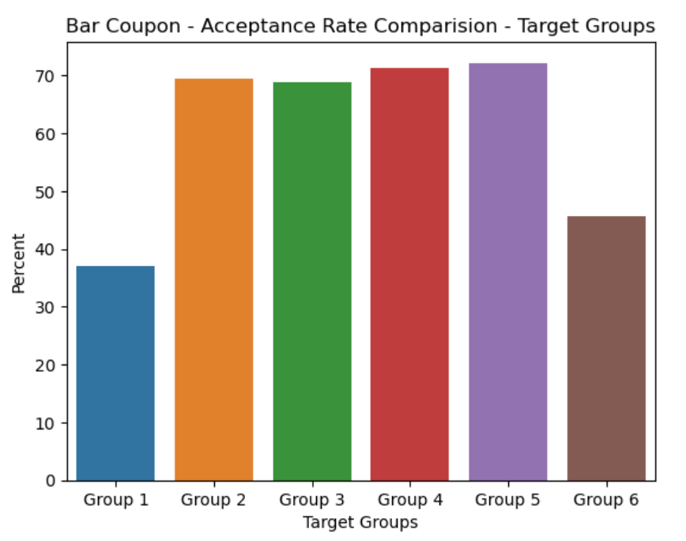

-   Bar coupons accepted by Target Group 1 (drivers who go to a bar 3 or fewer times a month) accounts for more than 80% of the total accepted Bar coupons

    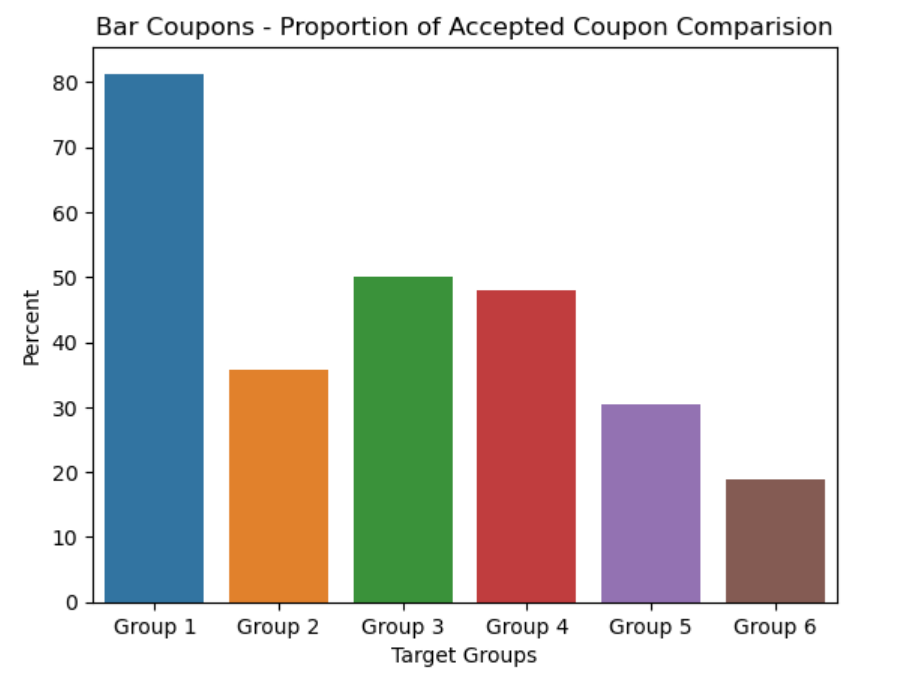

### Hypothesis

**Based on the above observations,** Bar coupon acceptance is largely contributed by the frequency of going to a bar (e.g. Bar attribute/feature) and drivers went to a bar more frequently tend to accept a Bar coupon more often.

### Analysis of Bar Coupon Acceptance and Frequency of going to a bar

The density curve in the violin chart below suggested that

-   People who never go to a bar tend to reject the bar coupons the most.
-   Rejection of Bar coupons decreases when the frequency of going to a bar increases.
-   Accepted Bar coupons are concentrated in drivers who went to a bar up to 3 times a month (“less1” group and “1-3” group)

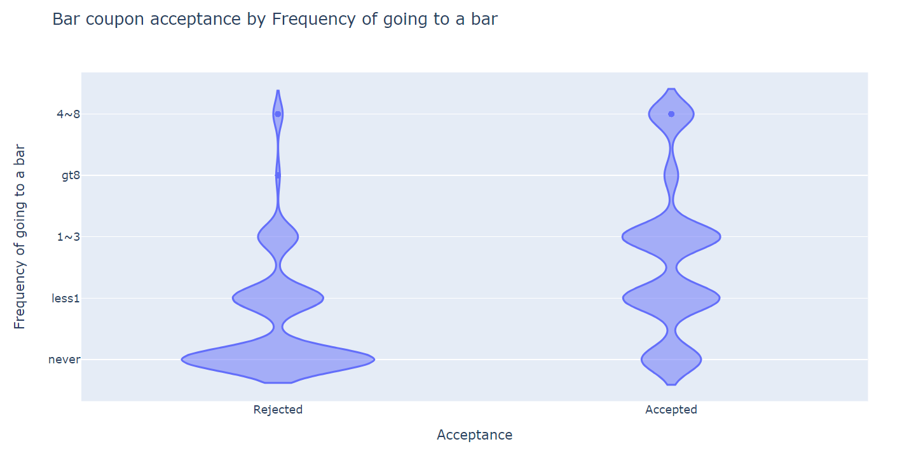

The bar chart below depicts the acceptance rate of the Bar coupons by Frequency of going to a bar. Driver group who went to bar from 4-8 times a month has the highest acceptance rate which is 78%.

The acceptance rates of driver groups who went to bar more than once a month are higher than 60%.

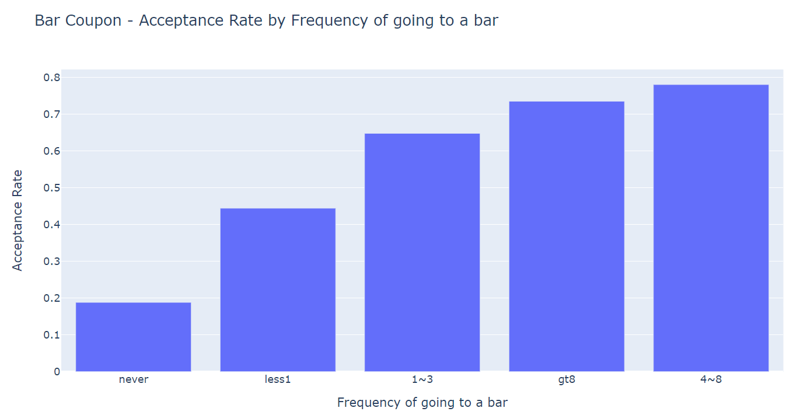

### Bar Coupon Analysis Conclusion

## Coffee House Coupon Analysis

### Proportion of Coffee House Coupon

The graphs below illustrate that Coffee House coupon type is the most offered coupon type. However, half of them were rejected. Still, Accepted Coffee House coupons account for 27.7% of accepted coupons. Accepted Coffee House coupons account for 36.6% of rejected coupons.

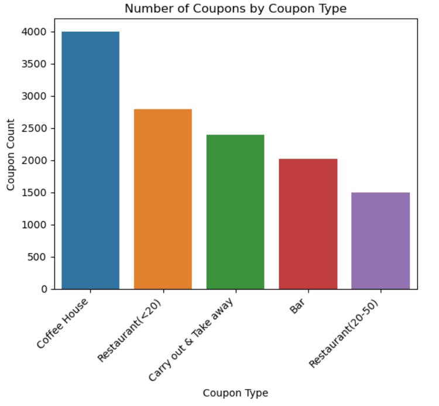

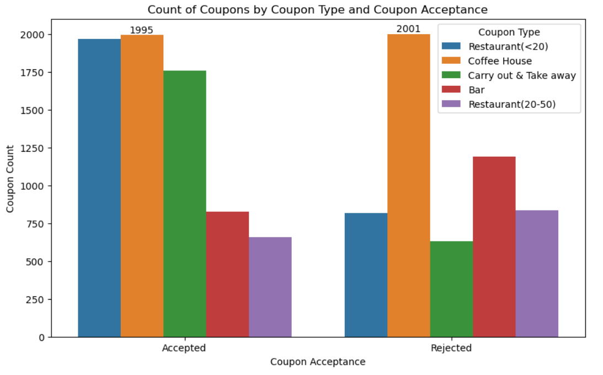

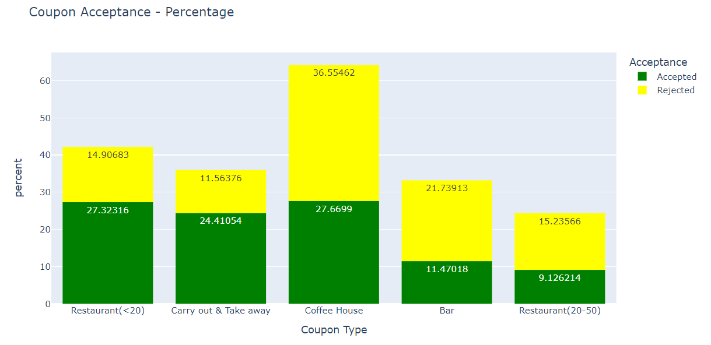

## Features that have a higher association with Coffee House coupon acceptance

In order to gain some insights to features that have more influences on the acceptance of the Coffee House coupon, a heatmap for the association matrix of both numeric features and categorical features was plotted with Seaborn.

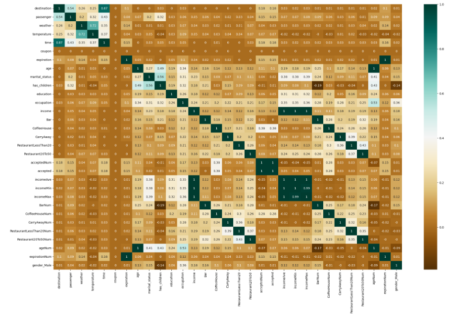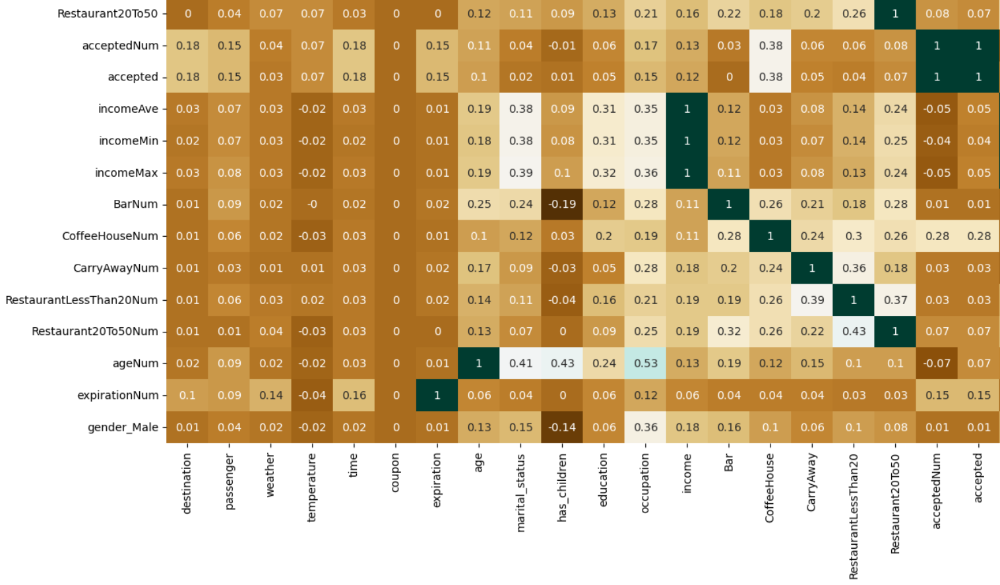

No strong correlation between the Accepted feature and other features are found. CoffeeHouse (Coffee house attendance frequency) feature is the feature that has the highest positive correlation with the Accepted (Coffeen House acceptance) feature. This suggested that the acceptance of the Coffee House coupons is driven by the frequency of going to a coffee house.

The Accepted feature has positive correlation with Destination (0.18), Passenger (0.15), Time (0.18), Expiration (0.15), Occupation (0.15). These features will be analyzed to gain more insights to the characteristics of driver who did or did not accept the Coffee House coupons.

## Analysis of Coffee House coupon acceptance and Frequency of going to a Coffee House

Similar to the Bar coupons, the density curve suggested that:

-   Rejection decreases when the frequency of going to a bar increases.
-   People who never go to a bar or went less than once a month tend to reject the bar coupon the most.
-   Accepted Coffee House coupons are concentrated in drivers who went to a bar up to 3 times a month (“less1” group and “1-3” group)

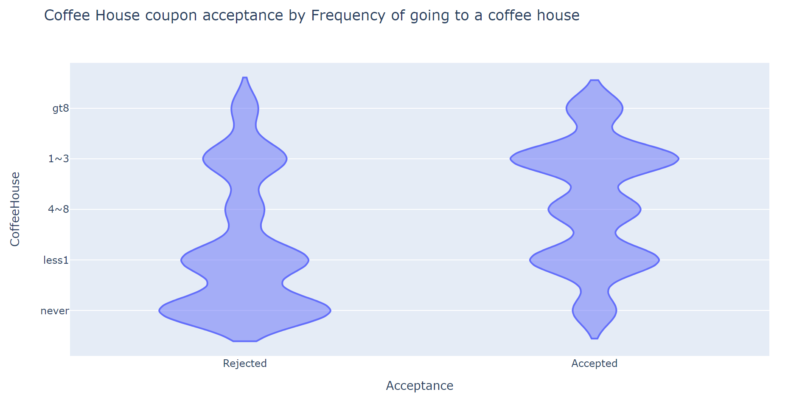

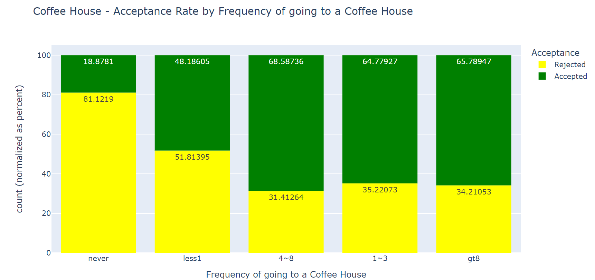

## Analysis of Coffee House coupon acceptance and Destination, Passenger, Time, Expiration, Occupation

-   **Destination:** Drivers tend to accept Coffee House coupons more than reject them when they drive to a non-urgent place

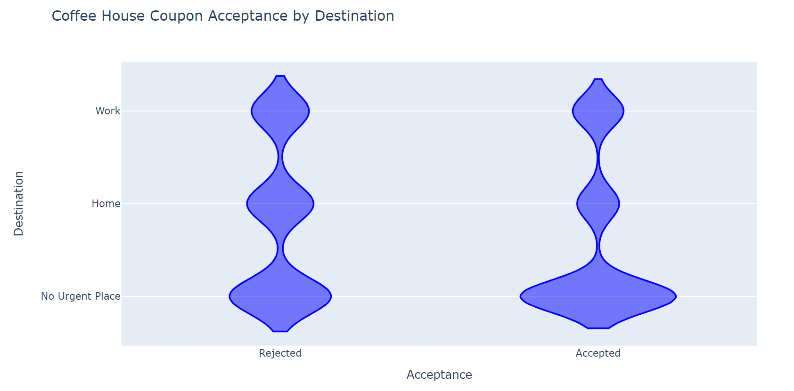

## 

-   **Passenger:** Currently, most of Coffee House coupons are offered to drivers who drive alone. However, more than half of them were rejected by these single drivers. The highest acceptance rates are those who drive with friends or partners. Therefore, Coffee House coupons should be offered to drivers with partner or friends to increase the overall Coffee House coupon acceptance rate.

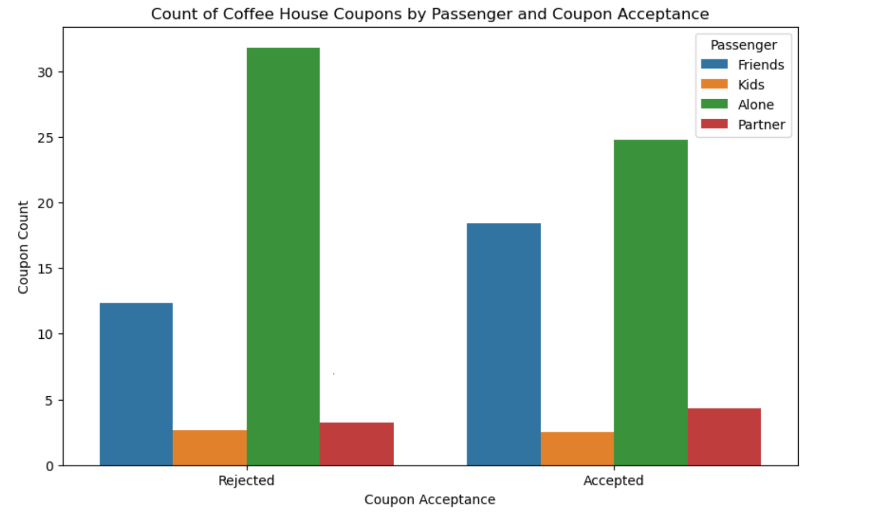

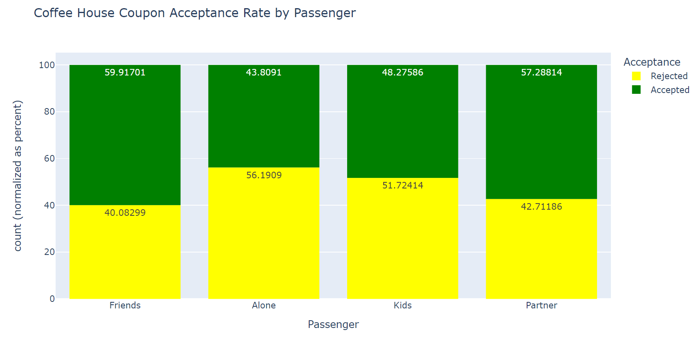

-   **Time and Expiration:** The sweet spot is at 10AM and expired in 2h

    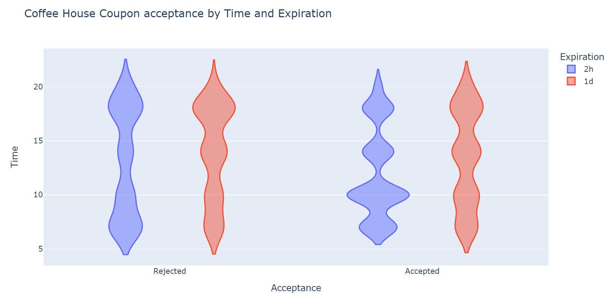

-   **Expiration:** Drivers tend to accept Coffee House coupons more than reject them when they drive to a non-urgent place
-   **Occupation:** Drivers tend to accept Coffee House coupons more than reject them when they drive to a non-urgent place
-   

## 

## 

## Coffee House coupon Analysis conclusion

## Next Steps and Recommendations
