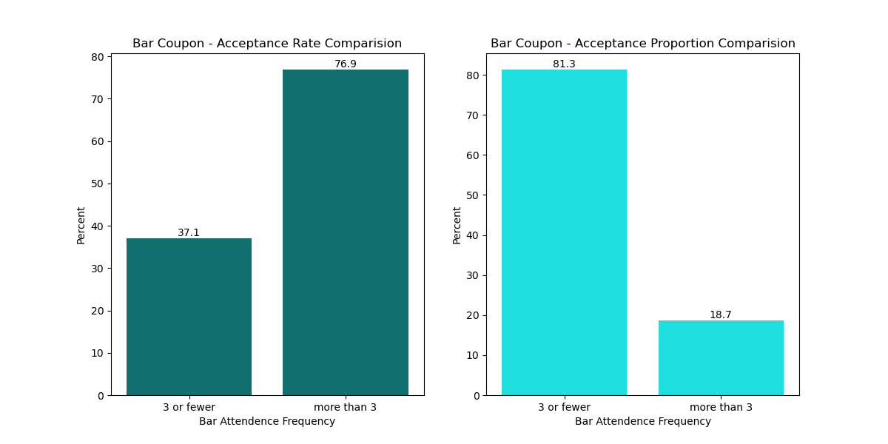

# Will a Customer Accept the Coupon?

## 1. Project Overview

The goal of this project is to develop a brief report that highlights the differences between customers or drivers who did and did not accept driving coupons by using visualizations and probability distributions.

## 2. Methodology

The Cross-Industry Standard Process for Data Mining (CRISP-DM) framework is applied to guide this effort. The framework includes five phases: business understanding, data understanding, data preparation, modeling, evaluation, and deployment. Due to the limited scope, this process will focus on the first three phases of the CRISP-DM framework.

## 3. Business Understanding

### 3.1 Background

Imagine driving through town and a coupon is delivered to your cell phone for a restaurant near where you are driving. Would you accept that coupon and take a short detour to the restaurant? Would you accept the coupon but use it on a subsequent trip? Would you ignore the coupon entirely? What if the coupon was for a bar instead of a restaurant? What about a coffee house? Would you accept a bar coupon with a minor passenger in the car? What about if it was just, you and your partner in the car? Would weather impact the rate of acceptance? What about the time of day?

Obviously, proximity to the business is a factor on whether the coupon is delivered to the driver or not, but what are the factors that determine whether a driver accepts the coupon once it is delivered to them? How would you determine whether a driver is likely to accept a coupon?

### 3.2 Objectives

The business objective is to distinguish between customers who accepted a driving coupon versus those that did not. This project attempts to answer the following questions:

-   What are two coupon types that can be selected for analysis?
-   What are the differences between drivers who accept and did not accept the selected driving coupons?

## 4. Data Understanding

### 4.1 Initial Data Collection

The initial data is from the UCI Machine Learning repository and was collected via a survey on Amazon Mechanical Turk. The survey describes different driving scenarios including the destination, current time, weather, passenger, etc., and then asks the person whether he will accept the coupon if he is the driver. Answers that the user will drive there ‘right away’ or ‘later before the coupon expires’ are labeled as ‘Y = 1’ and answers ‘no, I do not want the coupon’ are labeled as ‘Y = 0’. There are five different types of coupons -- less expensive restaurants (under \$20), coffee houses, carry out & take away, bar, and more expensive restaurants (\$20 - \$50).

### 4.2 Initial Data Description

Below are the attributes and description of the initial data.

| **No.**                   | **Attribute Name**   | **Attribute Description**                                                                          | **Attribute Value**                                                                                                              |
|---------------------------|----------------------|----------------------------------------------------------------------------------------------------|----------------------------------------------------------------------------------------------------------------------------------|
| **Customer attributes**   |                      |                                                                                                    |                                                                                                                                  |
| 1                         | gender               | Gender                                                                                             | male, female                                                                                                                     |
| 2                         | age                  | Age                                                                                                | below 21, 21 to 25, 26 to 30, etc.                                                                                               |
| 3                         | maritalStatus        | Marital Status                                                                                     | single, married partner, unmarried partner, or widowed                                                                           |
| 4                         | has_children         | Number of children                                                                                 | 0, 1, or more than 1                                                                                                             |
| 5                         | education            | Education                                                                                          | high school, bachelor’s degree, associate’s degree, or graduate degree                                                           |
| 6                         | occupation           | Occupation                                                                                         | architecture & engineering, business & financial, etc.                                                                           |
| 7                         | income               | Annual income                                                                                      | less than \$12500, \$12500 - \$24999, \$25000 - \$37499, etc.                                                                    |
| 8                         | car                  | Type of vehicles that customer is driving                                                          | mazda5, crossover, etc.                                                                                                          |
| 9                         | Bar                  | Number of times that he/she goes to a bar                                                          | 0, less than 1, 1 to 3, 4 to 8 or greater than 8                                                                                 |
| 10                        | CoffeeHouse          | Number of times that he/she goes to a coffee house                                                 | 0, less than 1, 1 to 3, 4 to 8 or greater than 8                                                                                 |
| 11                        | CarryAway            | Number of times that he/she buys takeaway food                                                     | 0, less than 1, 1 to 3, 4 to 8 or greater than 8                                                                                 |
| 12                        | RestaurantLessThan20 | Number of times that he/she eats at a restaurant with average expense less than \$20 per person    | 0, less than 1, 1 to 3, 4 to 8 or greater than 8                                                                                 |
| 13                        | Restaurant20To50     | Number of times that he/she eats at a restaurant with average expense from \$20 to \$50 per person | 0, less than 1, 1 to 3, 4 to 8 or greater than 8                                                                                 |
| **Coupon attributes**     |                      |                                                                                                    |                                                                                                                                  |
| 14                        | coupon               | Coupon types                                                                                       | less expensive restaurants (under \$20), coffee houses, carry out & take away, bar, and more expensive restaurants (\$20 - \$50) |
| 15                        | expiration           | Time before it expires                                                                             | 2 hours or one day                                                                                                               |
| **Contextual attributes** |                      |                                                                                                    |                                                                                                                                  |
| 16                        | destination          | Driving destination                                                                                | home, work, or no urgent destination                                                                                             |
| 17                        | passanger            | Passenger                                                                                          | alone, partner, kid(s), or friend(s)                                                                                             |
| 18                        | weather              | Weather                                                                                            | sunny, rainy, or snowy                                                                                                           |
| 19                        | temperature          | Temperature                                                                                        | 30F, 55F, or 80F                                                                                                                 |
| 20                        | time                 | Time                                                                                               | 10AM, 2PM, or 6PM                                                                                                                |
| 21                        | toCoupon_GEQ5min     | 5 minutes to venue                                                                                 | 0, 1                                                                                                                             |
| 22                        | toCoupon_GEQ15min    | 15 minutes to venue                                                                                | 15 minutes to venue                                                                                                              |
| 23                        | toCoupon_GEQ25min    | 25 minutes to venue                                                                                | 25 minutes to venue                                                                                                              |
| 24                        | direction_same       | Venue is in the same direction as the destination                                                  | 0, 1                                                                                                                             |
| 25                        | direction_opp        | Venue is in the opposite direction as the destination                                              | 0, 1                                                                                                                             |

### 4.3 Initial Data Exploration and Quality

After investigating the dataset for missing or problematic data, some observations are listed below:

-   Most features or attributes are categorical.
-   Misspellings are observed in some instances.
-   Special characters are included in the data.
-   The following attributes/features include NULL values.

| **Attributes**       | **Number of NULL Values** | **Percentage of NULL Values** |
|----------------------|---------------------------|-------------------------------|
| car                  | 12,576                    | 99%                           |
| Bar                  | 107                       | 0.8%                          |
| CoffeeHouse          | 271                       | 1.7%                          |
| CarryAway            | 151                       | 1.2%                          |
| RestaurantLessThan20 | 130                       | 1.0%                          |
| Restaurant20To50     | 189                       | 1.5%                          |

## 5. Data Preparation

### 5.1 Data Selection

As most of the values in the "car" column are NULL, this column is excluded from the dataset for analysis. In addition, this analysis focuses on factors of coupon acceptance once it is delivered to drivers whereas proximity to the business is a factor on whether the coupon is delivered to the driver or not. Therefore, these location related features are dropped from the dataset.

NULL values in Bar, CoffeeHouse, CarryAway, RestaurantLessThan20, Restaurant20To50 features account for a small percentage (less than 2%). When two sub datasets were created for analysis related to Bar and CoffeeHouse, NULL values in these two features were dropped.

### 5.2 Data Cleaning and Formatting

Data cleaning techniques were used to clean and format data, including:

-   Change the names of columns "Y", "passanger", "maritalStatus" to "acceptedNum", "passenger", "marital_status" for consistency, fixing spellings and easier to read.
-   Remove leading and trailing spaces.
-   Remove special characters in the 'passenger' column.
-   Create a new column called “accepted” with text values for column 'Y' or 'acceptedNum' for plotting purposes.

| **Current Values** | **New Values** |
|--------------------|----------------|
| 1                  | Accepted       |
| 0                  | Rejected       |

-   Calculate the average amount of each income range and assign the average amount, min amount, max amount to new columns called 'incomeAve', 'incomeMin', 'incomeMax'.
-   Create new columns with numeric values for columns: 'Bar', 'CoffeeHouse', 'CarryAway', 'RestaurantLessThan20', 'Restaurant20To50'.

| **Current Values** | **New Values** | **Description**           |
|--------------------|----------------|---------------------------|
| never              | 0              | Never                     |
| less1              | 1              | Less than once a month    |
| 1\~3               | 3              | 1 to 3 times a month      |
| 4\~8               | 8              | 4 to 8 times a month      |
| gt8                | 9              | More than 8 times a month |

-   Create new columns with numeric values for columns 'age', 'expiration', 'time'.
-   Use "get_dummies" function to convert the "gender" column to a numeric column.

## 6. Identify Coupon Type for Analysis

### 6.1 What proportion of the total observations chose to accept the coupon?

As depicted in the Seaborn count plot below, fifty-seven percent of the total observations chose to accept the offered coupons. While it is not a bad acceptance rate, there is still room to increase the overall coupon acceptance rate.

### 6.2 Coupon acceptance distribution

The Seaborn count plot and violin chart below suggested that:

-   Coffee House coupon is the most offered coupon type.
-   Accepted coupons are concentrated in three coupon types: Cheap restaurant, Coffee House and Carry out & Take Away coupons.
-   Rejected coupons are concentrated in two coupon types: Coffee House and Bar coupons.

### 6.3 Coupon acceptance rate

The Plotly histogram below displays the acceptance rates of each coupon type. Although Coffee House is the most offered coupon type, its acceptance rate is only 50%. This could be a factor contributing to the overall acceptance rate, which is slightly more than half as mentioned above.

The Carry out & Take away coupon type has the highest acceptance rate which is 74% and the Bar coupon type has the lowest acceptance rate which is 41%.

### 6.4 What are two coupon types that can be selected for analysis?

With an attempt to understand drivers’ behaviors in order to increase the overall acceptance rate, Bar coupon and Coffee House coupon will be analyzed because:

-   Bar coupon type has the lowest acceptance rate.
-   Coffee House coupon type is the most offered coupon type, but acceptance rate is only 50%.
-   Rejected coupons are concentrated in these two coupon types: Coffee House coupons and Bar coupons.

## 7. Bar Coupon Analysis

### 7.1 Proportion of accepted Bar coupons

Accepted Bar coupons account for 11.5% of accepted coupons, the second smallest proportion of the total number of accepted coupons. As illustrated in the charts above, Bar coupon is also the second smallest coupon type in terms of volume offered. In addition, the acceptance rate of Bar coupon is 41%.

### 7.2 Target Driver Groups to compare the Bar coupon acceptance rates

Acceptance rates were calculated and visualized for six target groups and six corresponding non-target groups of drivers. Below is the list of target groups and non-target groups.

| **Group \#** | **Target Attributes**                                               | **Target Group**                                                                                                                        | **Non-Target Group**                  |
|--------------|---------------------------------------------------------------------|-----------------------------------------------------------------------------------------------------------------------------------------|---------------------------------------|
| Group 1      | Frequency of going to a bar                                         | Goes to a bar 3 or fewer times a month                                                                                                  | Go to a bar more than 3 times a month |
| Group 2      | Frequency of going to a bar Age                                     | Goes to a bar more than once a month and are over the age of 25                                                                         | All others                            |
| Group 3      | Frequency of going to a bar Passenger in the vehicle Occupancy      | Goes to a bar more than once a month and had passengers that were not kids and had occupations other than farming, fishing, or forestry | All others                            |
| Group 4      | Frequency of going to a bar Passenger in the vehicle Marital status | Goes to a bar more than once a month and had passengers that were not kids and were not widowed                                         | All others                            |
| Group 5      | Frequency of going to a bar Age                                     | Goes to bars more than once a month and are under the age of 30                                                                         | All others                            |
| Group 6      | Frequency of going to cheap restaurants Income                      | Goes to cheap restaurants more than 4 times a month and income is less than 50K                                                         | All others                            |

The acceptance rates were calculated by using the following formula:

-   **Acceptance Rate of Target group** = Number of Bar coupons accepted by the Target Group / Number of Bar coupons offered to the Target Group
-   **Acceptance Rate of Non-Target group** = Number of Bar coupons accepted by the Non-Target Group / Number of Bar coupons offered to the Non-Target Group

In addition to the acceptance rates, proportion of accepted coupons was calculated with the following formula:

-   **Proportion of accepted coupons by Target group** = Number of Bar coupons accepted by the Target Group / Total Number of Bar coupons accepted
-   **Proportion of accepted coupons by Non-Target group** = Number of Bar coupons accepted by the Non-Target Group / Total Number of Bar coupons accepted

### 7.3 Observations of the Bar coupon acceptance rates of target groups

-   The acceptance rate of the Target Group 1 (those who went to a bar 3 or fewer times a month) is 37% and is much lower than the acceptance rate of the Non-Target Group 1 (those who went to a bar more than 3 times a month) which is 77%. Despite the low acceptance rate, 81% of the total number of accepted Bar coupons were accepted by the Target Group 1. This suggests that most of the Bar coupons were offered to this Target Group 1.

The acceptance rate of Target Groups 2 – 5, people who go to a bar more than once a month - regardless of the combination with other features such as age, passenger, occupancy - is about 70%. 

### 7.4 Hypothesis

**Based on the above observations, Bar coupon acceptance is largely contributed by the frequency of going to a bar (e.g. Bar attribute/feature) and drivers who went to a bar less frequently tend to reject a Bar coupon more often.**

### 7.5 Analysis of Bar Coupon Acceptance in relation to Bar Attendance Frequency

The violin chart below suggests that people who never go to a bar tend to reject the bar coupons the most. Rejection of Bar coupons decreases when the frequency of going to a bar increases. This is consistent with the above hypothesis.

The above violin chart also shows that Accepted Bar coupons are concentrated in drivers who went to a bar up to 3 times a month.

To further examine the acceptance behavior, the below chart was plotted to depict the acceptance rate of the Bar coupons by Frequency of going to a bar. There is an upward trend in acceptance rate from the driver group who do not go to a bar to the driver group who go to a bar up to 8 times a month. The driver group who went to a bar from 4-8 times a month has the highest acceptance rate, which is 78%. This is also consistent with the hypothesis.

However, the acceptance rate slightly reduces for drivers who go to a bar more than 8 times a month. Still, the acceptance rate of the driver group who go to a bar more than 8 times a month is higher than that of the driver group who go to a bar 1 - 3 times a month.

### 7.6 Conclusion and Recommendations - Bar Coupon

The above analysis suggests that the Bar coupon acceptance is largely driven by the bar attendance frequency. Bar coupons tend to be rejected by drivers who **never go to a bar or go to a bar less than once a month** and, therefore, **should be offered less**. To increase the current overall Bar coupon acceptance rate which is 41%, the Bar coupons should be **offered more to people who go to a bar more than once a month, especially to people who go to a bar 4 – 8 times a month** as this driver group has the highest acceptance rate which is 78%.

## 8. Coffee House Coupon Analysis

### 8.1 Proportion of Coffee House Coupons

As mentioned above and as illustrated by the chart below, Coffee House coupon type is the most offered coupon type. However, slightly more than half of them, as illustrated below, were rejected. 

Still, accepted Coffee House coupons account for 27.7% of all accepted coupons. It is the highest proportion of accepted coupons. Rejected Coffee House coupons account for 36.6% of all rejected coupons. It is also the highest proportion of rejected coupons.

### 8.2 Features that have a higher association with Coffee House coupon acceptance

To gain some insights to features that have more influence on the acceptance of the Coffee House coupons, a heatmap for the association matrix of both numeric features and categorical features was plotted with Seaborn.

No strong association between the Accepted feature and other features is found. CoffeeHouse (Coffee House attendance frequency) feature is the feature that has the highest positive association with the Accepted (Coffee House acceptance) feature. This suggests that the acceptance of the Coffee House coupons is, to some extent, driven by the frequency of going to a Coffee House.

The Accepted feature has positive associations with Destination (0.18), Passenger (0.15), Time (0.18), Expiration (0.15). These features will be analyzed to gain more insights into the characteristics of drivers who did or did not accept the Coffee House coupons.

### 8.3 Analysis of Coffee House coupon acceptance and Frequency of going to a Coffee House

Like the Bar coupons, the violin chart below suggests that:

- People who never go to a Coffee House tend to reject the Coffee House coupons the most.
- Rejection of Coffee House coupons decreases when the frequency of going to a Coffee House increases.
- Accepted Coffee House coupons are concentrated in drivers who went to a Coffee House up to 3 times a month.

The below chart depicts the acceptance rate of the Coffee House coupons by Frequency of going to a Coffee House. Like the Bar coupon type, there is an upward trend in acceptance rate from the driver group who does not go to a Coffee House to the driver group who goes to a Coffee House up to 8 times a month. The driver group who went to a Coffee House 4-8 times a month has the highest acceptance rate, which is 69%. Then, it slightly drops to 66% when drivers go to Coffee House more than 8 times a month.

### 8.4 Analysis of Coffee House coupon acceptance and Destination, Passenger, Time, Expiration

- **Destination:** Drivers tend to accept Coffee House coupons more than reject them when they drive to a non-urgent place.

- **Passenger:** Currently, most Coffee House coupons are offered to drivers who drive alone. However, more rejected the coupons than accepted them. The higher acceptance rates are those who drive with friends or a partner. This makes sense as people enjoy company when going to a Coffee House. Therefore, Coffee House coupons should be offered to drivers with a partner or friend to increase the overall Coffee House coupon acceptance rate.

- **Time and Expiration:** Although 1d (1 day) expiration Coffee House coupons perform better than 2h (2 hour) expiration Coffee House coupons (i.e., the acceptance rate of the 2h coupons is lower), it appears that 10AM is the sweet spot for the 2h expiration Coffee House coupons.

### 8.5 Conclusion and Recommendations - Coffee House Coupon

Like the Bar coupon, the above analysis suggests that the Coffee House coupon acceptance is largely driven by the Coffee House attendance frequency. Coffee House coupons tend to be rejected by **drivers who never go to a Coffee House or go to a Coffee House less than once a month** and, therefore, **should be offered less**. To increase the current overall Coffee House coupon acceptance rate which is 50%, the Coffee House coupons should be **offered more to people who go to a Coffee House more than once a month, especially to people who go to a Coffee House 4 – 8 times a month** as this driver group has the highest acceptance rate which is 69%.

In addition, Coffee House coupons should be **offered less to people who drive alone**. Instead, it should be **offered to people who drive with friends or with a partner**. While **2h coupons** have a lower acceptance rate, **10AM would be a good time to offer** this coupon. Lastly, **people who drive to non-urgent places tend to accept Coffee House coupons more and therefore Coffee House coupons should be offered more to these drivers.**

## 9. Next Steps and Recommendations

There are five coupon types and two of them have been reviewed. The next step is to analyze the acceptance behavior for the remaining three coupons; especially the “Carry out & take away” coupon because it has the highest acceptance rate which is 74% and accounts for approximately a quarter of the total number of accepted coupons.

In addition, based on the analysis of the Bar coupon type and the Coffee House coupon type, a general hypothesis for the remaining coupon types could be that the coupon acceptance is largely influenced by the attendance frequency and drivers who ordered take away or went to a restaurant (cheap or more expensive) less frequently tend to reject the corresponding coupon more often. In addition, accepted coupons the remaining three types may be concentrated in drivers who have 1-3 attendance frequency. Having said that, it is important to investigate the dataset related to the remaining coupons to prove or disprove the suggested hypothesis.

Lastly, the project can be continued with the remaining three phases of the CRISP-DM framework. They are modeling, evaluation, and deployment.

## 10. Jupyter Notebook 

Please refer to the [Coupons Jupiter Notebook](coupons_final.ipynb) for more information.
